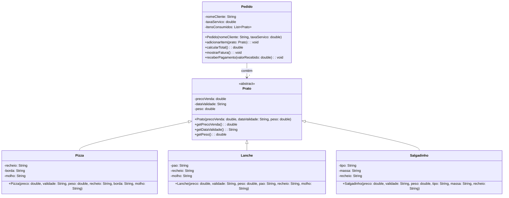

# Sistema de Lanchonete - Protótipo Inicial

## 1. Diagrama de Classes Finalizado

## 2. Escolhas de Design e Funcionamento do Sistema

O sistema foi modelado utilizando os princípios de Programação Orientada a Objetos, com destaque para a **Herança** e o **Polimorfismo**, conforme solicitado.

### Arranjo entre Classes (Herança)
- **Classe Abstrata `Prato`**: Analisando os requisitos, foi possível identificar que `Pizza`, `Lanche` e `Salgadinho` compartilham atributos comuns: *preço de venda*, *data de validade* e *peso*. Para evitar a repetição de código (conceito DRY) e garantir uma estrutura padronizada, foi criada a superclasse (classe mãe) abstrata `Prato`, contendo esses atributos em comum.
- **Classes Filhas (`Pizza`, `Lanche`, `Salgadinho`)**: Cada item de cardápio específico herda da classe `Prato` e adiciona seus próprios atributos peculiares detalhados nos requisitos (ex: `pao` para Lanche, `borda` para Pizza, e `tipo` (frito/assado) para Salgadinho). Notamos que o esboço original do diagrama do desenvolvedor necessitava da adição do atributo `tipo` na classe `Salgadinho`, o qual foi devidamente inserido.
- **Omissão de métodos incompletos (`calcularPreco()`) nas classes filhas**: O diagrama preliminar sugeria um método `calcularPreco(): void`. No entanto, como os requisitos estipulam apenas que os itens "devem conter o preço de venda", optamos por definir esse preço diretamente via construtor da classe mãe, simplificando o modelo inicial. Caso a lógica de negócio posteriormente estipule que o preço depende da soma dos ingredientes ou do peso, essa regra poderá facilmente ser adicionada sem afetar drasticamente o polimorfismo.

### Relacionamento e Polimorfismo
- **Classe `Pedido`**: Atua como o agregador do fluxo. Ela contém uma lista de itens consumidos (`List<Prato>`). Aqui brilha o **Polimorfismo**: o `Pedido` pode aceitar e armazenar qualquer objeto que seja filho de um `Prato` (seja Pizza, Lanche ou Salgadinho) usando apenas o método `adicionarItem(Prato prato)`. A classe não precisa conhecer os detalhes ou de métodos sobrecarregados para adicionar cada subtipo especificamente.
- Ao calcular o total da fatura através de `calcularTotal()`, o sistema apenas itera sobre a lista de `Pratos`, invocando o método genérico `getPrecoVenda()`. 

### Funcionamento e Nota Fiscal
- O método `mostrarFatura()` presente na classe `Pedido` itera sobre a lista de pratos consumidos formatando-os na tela, exibindo a soma total mais a taxa de serviço requerida e gerando assim a "nota fiscal" solicitada pelo cliente.
- O método `receberPagamento(double valorRecebido)` permite a inserção virtual do valor recebido em dinheiro, validando se ele é suficiente para abater a fatura e, em seguida, calculando e exibindo o respectivo troco na tela, cumprindo estritamente o 5º requisito levantado pelo cliente.
- A classe principal `Main` foi criada para orquestrar o fluxo, instanciando os diferentes tipos de pratos, inserindo-os num pedido, emitindo a nota fiscal e rodando a funcionalidade de pagamento para validar todo o protótipo.
