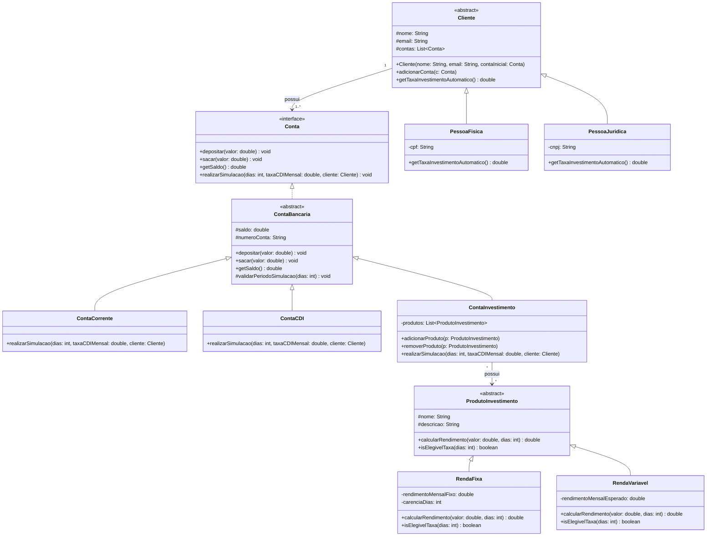

# 🏦 Escritório de Investimentos VcRiquinho — Protótipo

Este repositório contém a documentação e o protótipo do sistema do **Escritório de Investimentos VcRiquinho**, desenvolvido com base nos pilares e boas práticas da **Programação Orientada a Objetos (POO)**.

---

## 1. Estrutura de Classes (UML)



## 2. Principais Decisões de Implementação

O projeto foi desenvolvido com base nos princípios da **Programação Orientada a Objetos (POO)**, buscando organizar as responsabilidades entre as classes, reduzir a duplicação de código e facilitar futuras alterações no sistema.

### Encapsulamento e Regras de Negócio

- **Conta obrigatória para cada cliente:** todo cliente deve possuir uma conta no momento de sua criação. O construtor de `Cliente` e de suas subclasses valida a conta informada. Caso o valor seja `null`, uma `IllegalArgumentException` é lançada.

- **Validação dos períodos de simulação:** a classe `ContaBancaria` centraliza a validação dos períodos permitidos para as simulações. As classes especializadas reutilizam essa regra antes de realizar seus cálculos.

- **Proteção dos atributos:** os atributos das classes possuem modificadores `private` ou `protected`, evitando alterações diretas e garantindo maior controle sobre o estado dos objetos.

### Herança, Abstração e Interfaces

A interface `Conta` define os comportamentos básicos que devem estar disponíveis em todas as contas:

```text
depositar(valor)
sacar(valor)
getSaldo()
realizarSimulacao(...)
